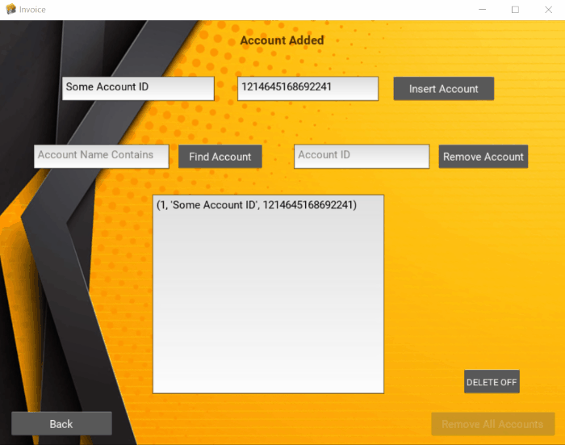
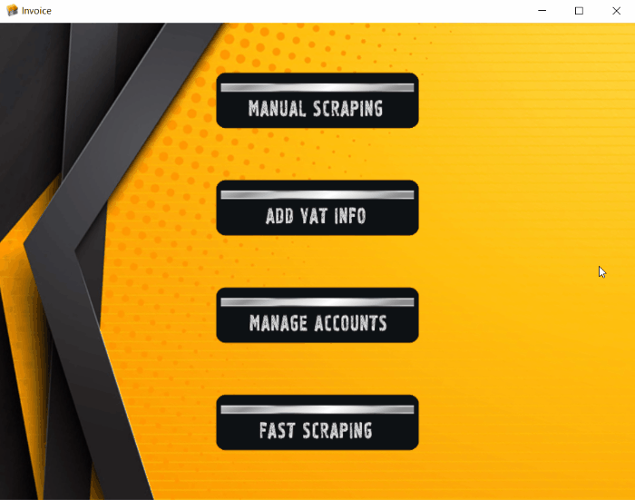

<h1 align="center">
  <br>
  
  <br>InvoicesApp
</h1>

<h4 align="center">Python-Kivy App for automating invoices extraction.</h4>

<p align="center">
  <a href="https://img.shields.io/badge/Made%20with-Python-blue">
    
  </a>
  <a href="https://img.shields.io/tokei/lines/github/Bogo56/AdCapture_bot">
      
  </a>
  <a href="https://img.shields.io/github/languages/count/Bogo56/AdCapture_bot?color=f">
    
  </a>
  <a href="https://badgen.net/github/commits/Bogo56/AdCapture_bot">
    
  </a>
</p>

<p align="center">
  <a href="#about-the-project">About The Project</a> •
  <a href="#description-of-the-problem">Description of the problem</a> •
  <a href="#how-to-use">How to use</a> •
  <a href="#project-workflow">Project Workflow</a> •
  <a href="#project-structure">Project Structure</a> 
</p>

## Built With
###  Languages
<p>
  
  
<p>
  
### Frameworks
<p>

</p>

### Databases
<p>

</p>

### Additional Libraries and Technologies
<p>
  
  
  
  
</p>

## About The Project
This was another project that is inspired by **a real-world challenge** that we had at our company. The goal was to **automate the boring** administrative **task** of **downloading and clasifying invoices** at the end of each month. This was very time consuming and repetative, so I really felt that this was a time better spent at more productive activities.

## Description of the problem
At the end of each month all of the invoices for the money spend on advertising had to be downloaded and ordered based on the payment cards being used.There are tens of different ad accounts - each receiving multiple invoices ( depending on the advertising activity for the month). So each invoice has to be downloaded separately and so the cumulative **sum of invoices per month is in the range between 120 and 230**. This **means between 4-7 hours of wasted time** at the end of each month.

### And the Solution
I wanted to create a solution that would be **usefull to all my teammates** and not just myself. That's why a simple script was not enough. So I had to create an app that **could be used by anyone and mainly non-coders**. This is how I came up with this project. It basically visits every single ad account, scrapes the datails of every invoice for that account and then injects that into an Excel File, creating a spreadsheet for the separate ad account.

* #### It takes the bot 10 min. vs 4-7 hours for a person from the team

## How To Use
1. **Insert the Id's of the ad accounts you would like to get the invoices of into the Database.**
       

2. **Add the VAT info.**
   - once inserted, the data is persisted in the app - so you don't have to configure it every time
     

3 **Choose your mode**
  * **Fully automated mode**
    - If you want to process all accounts in the database - use this method - runs the bot in a single click.
    
      
      
  * **Manual mode**
    - Use this mode if you want to run the bot for specific accounts only, or when you want to manipulate the bot in real time.   
    
      
    
    


## Project Workflow
Here, I'm outlining very briefly the phases that the project went trough from start to finish.

### Phase 1 - Manipulating the browser programatically - SELENIUM
First I needed a tool to automate browser navigation - this is where I used Selenium - one of the most popular libraries for software testing and browser automation. I used it to run Chrome in headless mode. I also used Selenium for navigation and scraping of the DOM.
  
### Phase 2 - Structuring scraped data - PANDAS
Next I had to organize the data that I scraped in a meaningfull way. Using Excel Tables was very appropriate. I used the Pandas library, which is the right tools for this kind of operations.

### Phase 3 - Persisting data - SQLite
I needed a way to store data - to achieve real automation. So I used SQlite because it's embedded and self-contained. Making it easy to be packaged inside the app.

### Phase 4 - Making the functionality available to people with no coding skills - KIVY
Now it was the time to create a real usable app out of all that functionality. I decided to use KIVY - since I had some previous experience with it. The main perks were that it was possible to build a simple but intuitive interface and also to package the whole thing into a single executable file, so that others can use it on their PC. There are a lot of functionalities with this framework, which were quite handy.

### Phase 5 - Distributing the app - PyInstaller
I used PyInstaller to package all of the modules and files and make them executable through a single .exe file.

## Project Structure
```
📦 Invoices_App
├─ .gitignore
├─ App_exe
│  └─ InvoicesAPP.spec
├─ README.md
├─ app.py
├─ controller.py
├─ gifs   
├─ model
│  └─ model.py
├─ modules
│  ├─ dates.py
|  ├─ dir_maker.py
|  ├─ table_tool.py
│  └─ webdriver.py
├─ requirements.txt
├─ security
│  └─ encryption.py
└─ views
   ├─ __init__.py
   ├─ accounts_menu.kv
   ├─ add_account.kv
   ├─ fast_flow.kv
   ├─ main.py
   ├─ main_menu.kv
   ├─ resources
   │  ├─ background
   │  │  ├─ Untitled-1.psd
   │  │  ├─ app_bg.png
   │  │  ├─ app_bg_1.png
   │  │  ├─ app_bg_2.png
   │  │  ├─ app_bg_3.png
   │  │  ├─ app_bg_4.png
   │  │  ├─ f6f57aa2-abstract-yellow-background.jpg
   │  │  └─ yellow_bg.png
   │  ├─ buttons
   │  │  ├─ 16926.eps
   │  │  ├─ 16926.jpg
   │  │  ├─ 16926.psd
   │  │  ├─ Accounts.png
   │  │  ├─ FAST_FLOW.png
   │  │  ├─ Manual.png
   │  │  └─ VAT.png
   │  └─ icons
   │     ├─ 1260673.png
   │     ├─ invoices-icon-18829.png
   │     └─ invoices.ico
   └─ vat_info.kv
```
©generated by [Project Tree Generator](https://woochanleee.github.io/project-tree-generator)
